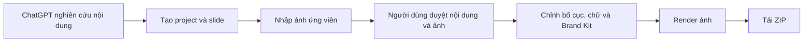
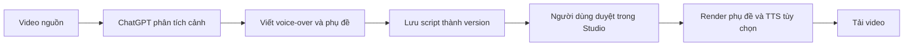

# Lana Carousel MCP Standalone

Dịch vụ **Model Context Protocol (MCP)** độc lập để ChatGPT tạo, quản lý và xuất bản nội dung hình ảnh/video cho La.na Design.

Hệ thống kết hợp:

- MCP server cho ChatGPT.
- Web Studio để người dùng duyệt và chỉnh sửa trực quan.
- SQLite để lưu dự án và lịch sử phiên bản.
- Sharp để xử lý ảnh.
- Remotion để render video.
- Google Cloud Text-to-Speech cho voice-over tùy chọn.

> Mã nguồn ứng dụng nằm trong thư mục [`lana-carousel-mcp-standalone/`](./lana-carousel-mcp-standalone).

## Production

| Dịch vụ | URL |
|---|---|
| MCP endpoint | `https://content.lanadesign.tech/mcp` |
| Project dashboard | `https://content.lanadesign.tech/projects` |
| Video Analysis Studio | `https://content.lanadesign.tech/video-studio` |
| Health check | `https://content.lanadesign.tech/health` |

## Luồng hoạt động

### 1. Carousel Studio



Quy tắc quan trọng: **một slide đại diện cho một chủ đề nội dung**. Nhiều ảnh thay thế của cùng chủ đề phải được gắn vào cùng slide dưới dạng image candidates, không tạo thêm slide riêng cho từng ảnh.

### 2. Video Analysis Studio



Video Analysis là project độc lập với carousel. ChatGPT chịu trách nhiệm phân tích video và chỉ gửi script có cấu trúc sang Lana để lưu phiên bản, chỉnh sửa và render.

## Tính năng chính

### Quản lý carousel

- Tạo project và tối đa 20 slide nội dung qua MCP.
- Tìm kiếm, nhân bản, gia hạn và xóa project.
- Tự động hết hạn project sau 14 ngày.
- Lưu lịch sử phiên bản và khôi phục phiên bản cũ.
- Dashboard quản lý project trên web.

### Nhập và duyệt ảnh

- Nhập ảnh từ URL HTTPS.
- Theo redirect có giới hạn và gửi User-Agent.
- Chặn SSRF và địa chỉ mạng nội bộ.
- Kiểm tra MIME type, magic bytes, dung lượng và timeout.
- Chuẩn hóa JPG, PNG và WebP thành WebP bằng Sharp.
- Tối đa 10 ảnh ứng viên cho mỗi slide.
- Duyệt một ảnh dạng crop hoặc nhiều ảnh dạng grid.

### Trình chỉnh sửa thiết kế

- Preview dọc 9:16 khớp đầu ra 1080×1920.
- Crop, zoom và chọn trọng tâm ảnh.
- Điều chỉnh sáng, tương phản, bão hòa, đen trắng và blur.
- Tùy chỉnh viền, khoảng cách, độ mờ và bo góc.
- Nhiều lớp chữ kéo thả độc lập.
- Chỉnh font, cỡ chữ, màu, vị trí, căn lề, độ mờ và góc xoay.
- Định dạng riêng từng vùng chữ được chọn.
- Hộp chữ có nền, viền, padding, opacity và border radius.
- Brand Kit và áp dụng thiết kế cho nhiều slide.
- Undo/redo trong trình chỉnh sửa.

### Render

- Render ảnh nền theo hàng đợi.
- Theo dõi tiến độ render.
- Xuất toàn bộ carousel thành ZIP.
- Video Remotion tùy chọn với các tỷ lệ 9:16, 1:1 và 16:9.
- Hỗ trợ transition, Ken Burns, hiệu ứng chữ, nhạc nền, phụ đề và TTS.

### Video Analysis

- Tạo project phân tích video độc lập.
- Gắn video nguồn bằng HTTPS reference.
- Lưu script voice-over/phụ đề dạng immutable version.
- Khôi phục một version thành version mới.
- Studio chỉnh sửa segment theo timeline.
- Render phụ đề và TTS sau khi script được duyệt.

## Kiến trúc

```text
ChatGPT
   │
   │ MCP Streamable HTTP
   ▼
Express HTTP Server
   ├── MCP tools
   ├── REST API
   ├── Carousel Web Studio
   ├── Video Analysis Studio
   ├── Image importer + SSRF protection
   ├── Sharp image renderer
   ├── Remotion video renderer
   └── SQLite + local asset storage
```

## Cấu trúc repository

```text
.
├── README.md
├── .gitignore
└── lana-carousel-mcp-standalone/
    ├── public/
    │   ├── projects.html
    │   ├── video-studio.html
    │   ├── video-studio.js
    │   ├── widget.html
    │   └── widget.js
    ├── src/
    │   ├── config.js
    │   ├── db.js
    │   ├── http-server.js
    │   ├── image-importer.js
    │   ├── mcp-server.js
    │   ├── mcp-tools.js
    │   ├── render-jobs.js
    │   ├── service.js
    │   ├── ssrf.js
    │   ├── video-analysis-jobs.js
    │   ├── video-analysis-routes.js
    │   ├── video-analysis-service.js
    │   └── video-jobs.js
    ├── video/
    ├── .env.example
    ├── Dockerfile
    ├── docker-compose.yml
    ├── ecosystem.config.cjs
    ├── package.json
    └── package-lock.json
```

## Yêu cầu

- Node.js 20 trở lên.
- npm.
- Domain HTTPS công khai khi kết nối từ ChatGPT.
- Dung lượng ổ đĩa cho SQLite, ảnh nguồn và kết quả render.
- Google Cloud credentials chỉ cần khi sử dụng Google Cloud TTS.

## Cài đặt local

```bash
git clone https://github.com/nguyentuanson27-netizen/lana-carousel-mcp-standalone.git
cd lana-carousel-mcp-standalone/lana-carousel-mcp-standalone
cp .env.example .env
npm install
npm run check
npm start
```

Server mặc định chạy tại:

```text
http://localhost:8787
```

Các trang local:

```text
http://localhost:8787/projects
http://localhost:8787/video-studio
http://localhost:8787/health
http://localhost:8787/mcp
```

## Chạy MCP qua stdio

```bash
cd lana-carousel-mcp-standalone
npm run mcp
```

## Chạy bằng Docker Compose

```bash
cd lana-carousel-mcp-standalone
docker compose up -d --build
```

Dữ liệu được mount từ thư mục local `./data` vào `/app/data` trong container.

Kiểm tra:

```bash
curl http://localhost:8787/health
```

Dừng dịch vụ:

```bash
docker compose down
```

## Chạy production bằng PM2

```bash
cd lana-carousel-mcp-standalone
npm install
npm run check
pm2 start ecosystem.config.cjs
pm2 save
```

Khi triển khai public, đặt reverse proxy HTTPS như Nginx hoặc Caddy phía trước cổng `8787` và cấu hình `PUBLIC_BASE_URL` bằng domain thật.

## Biến môi trường

| Biến | Mặc định | Mô tả |
|---|---:|---|
| `PORT` | `8787` | Cổng HTTP server |
| `PUBLIC_BASE_URL` | `http://localhost:8787` | Base URL dùng để sinh link public |
| `DATABASE_PATH` | `./data/lana-carousel.sqlite` | Đường dẫn SQLite |
| `ASSET_DIRECTORY` | `./data/assets` | Thư mục lưu asset |
| `MAX_IMAGE_BYTES` | `10485760` | Dung lượng ảnh tối đa, mặc định 10 MB |
| `IMAGE_TIMEOUT_MS` | `15000` | Timeout tải ảnh, tính bằng mili giây |
| `MAX_REDIRECTS` | `3` | Số redirect tối đa khi tải ảnh |

Tạo file cấu hình:

```bash
cp .env.example .env
```

Không commit file `.env`, credential Google Cloud, SSH key, token, database production hoặc thư mục asset.

## Kết nối với ChatGPT

1. Mở **Settings → Apps → Advanced Settings**.
2. Bật **Developer mode**.
3. Chọn **Create App**.
4. Đặt tên, ví dụ `Lana Carousel App 2`.
5. Nhập MCP endpoint:

   ```text
   https://content.lanadesign.tech/mcp
   ```

6. Chọn phương thức xác thực phù hợp với môi trường triển khai.
7. Bấm **Scan Tools** rồi tạo app.
8. Chọn app trong cuộc trò chuyện trước khi gửi prompt.

Sau khi thay đổi schema MCP tools, cần **Scan Tools/Refresh Actions** lại trong ChatGPT.

## MCP tools

### Carousel project

| Tool | Chức năng |
|---|---|
| `create_project` | Tạo carousel project |
| `add_slide` | Thêm một slide nội dung |
| `get_project` | Đọc toàn bộ project |
| `get_project_link` | Lấy link mở Web Studio |
| `list_projects` | Danh sách và tìm kiếm project |
| `clone_project` | Nhân bản project |
| `extend_project` | Gia hạn thời gian tồn tại |
| `delete_project` | Xóa vĩnh viễn project và asset |

### Nội dung, ảnh và thiết kế

| Tool | Chức năng |
|---|---|
| `update_slide_content` | Sửa headline và body |
| `update_slide_design` | Sửa crop và style chữ chính |
| `approve_content` | Duyệt toàn bộ nội dung |
| `import_asset_from_url` | Gắn một ảnh cuối cùng vào slide |
| `add_image_candidate` | Thêm một ảnh ứng viên |
| `add_image_candidates` | Thêm hàng loạt 1–10 ảnh ứng viên |
| `approve_slide_images` | Duyệt ảnh theo crop hoặc grid |
| `update_brand_kit` | Lưu và áp dụng font/màu thương hiệu |

### Render và version

| Tool | Chức năng |
|---|---|
| `render_project` | Bắt đầu render carousel |
| `get_render_status` | Theo dõi tiến độ và lấy download URL |
| `list_project_versions` | Danh sách version |
| `restore_project_version` | Khôi phục version |

### Video Analysis

| Tool | Chức năng |
|---|---|
| `create_video_analysis_project` | Tạo project phân tích video độc lập |
| `get_video_analysis_project` | Đọc project và lấy Studio URL |
| `attach_video_reference` | Gắn video nguồn qua HTTPS |
| `save_approved_video_script` | Lưu script thành version mới |
| `list_video_analysis_versions` | Danh sách version script/settings |
| `restore_video_analysis_version` | Khôi phục version |
| `start_video_analysis_render` | Bắt đầu render phụ đề và TTS |
| `get_video_analysis_job` | Theo dõi job và lấy download URL |

## REST API tiêu biểu

| Method | Endpoint | Mô tả |
|---|---|---|
| `GET` | `/health` | Health check |
| `ALL` | `/mcp` | MCP Streamable HTTP endpoint |
| `GET` | `/projects` | Project dashboard |
| `GET` | `/widget` | Carousel editor |
| `GET` | `/video-studio` | Video Analysis Studio |
| `GET` | `/api/projects` | Danh sách project |
| `POST` | `/api/projects` | Tạo project |
| `GET` | `/api/projects/:projectId` | Đọc project |
| `DELETE` | `/api/projects/:projectId` | Xóa project |
| `POST` | `/api/projects/:projectId/clone` | Nhân bản project |
| `POST` | `/api/projects/:projectId/extend` | Gia hạn project |
| `POST` | `/api/projects/:projectId/render-jobs` | Tạo render job |
| `PATCH` | `/api/projects/:projectId/video` | Cập nhật cấu hình video |
| `PATCH` | `/api/projects/:projectId/slides/:slideId/video` | Cập nhật cấu hình video của scene |
| `POST` | `/api/projects/:projectId/video-render-jobs` | Tạo Remotion render job |
| `*` | `/api/video-analysis/*` | API của Video Analysis Studio |

## Prompt mẫu: tạo carousel

```text
Hãy sử dụng Lana Carousel App 2 để tạo carousel:

- Chủ đề: Top 5 thương hiệu áo dài nổi bật năm 2026.
- Tổng cộng 6 slide: 1 slide mở đầu và 5 slide thương hiệu.
- Mỗi chủ đề chỉ tạo một slide.
- Không tạo slide riêng cho từng ảnh.
- Mỗi slide nhập 3–5 ảnh ứng viên bằng add_image_candidates.
- Không tự duyệt nội dung, không tự duyệt ảnh và không render.
- Sau khi hoàn thành, gọi get_project_link và gửi link dự án.
```

## Prompt mẫu: phân tích video

```text
Phân tích video tôi vừa gửi theo thứ tự:

1. Tóm tắt nội dung và xác định các cảnh chính.
2. Viết voice-over tiếng Việt tự nhiên.
3. Tạo phụ đề theo từng mốc thời gian.
4. Tạo Video Analysis project độc lập.
5. Gắn video nguồn.
6. Lưu script đã duyệt thành một version.
7. Gửi link Video Analysis Studio trực tiếp trong chat.

Không render video cho đến khi tôi yêu cầu.
```

## Kiểm tra mã nguồn

Project hiện dùng kiểm tra cú pháp Node.js:

```bash
npm run check
```

Lệnh này kiểm tra các module cấu hình, database, bảo mật URL, nhập ảnh, service, MCP, HTTP server và video analysis.

## Bảo mật triển khai

- MCP endpoint hiện có thể được triển khai không xác thực; không nên mở public nếu chưa có lớp bảo vệ phù hợp.
- Đặt reverse proxy HTTPS phía trước ứng dụng.
- Giới hạn truy cập bằng authentication, VPN, IP allowlist hoặc Cloudflare Access khi dùng nội bộ.
- Không dùng `PUBLIC_BASE_URL=http://localhost...` trong production.
- Sao lưu thư mục `data/` trước khi nâng cấp hoặc di chuyển server.
- Không commit `.env`, credential, database hoặc asset production.

## License

Repository hiện chưa khai báo license mã nguồn mở. Mặc định, mọi quyền thuộc về chủ sở hữu repository cho đến khi một file `LICENSE` được bổ sung.
